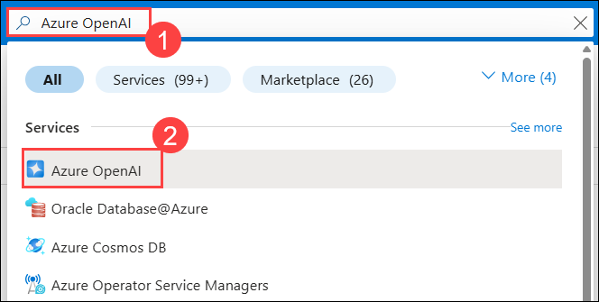
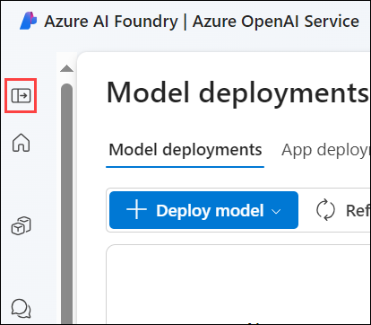
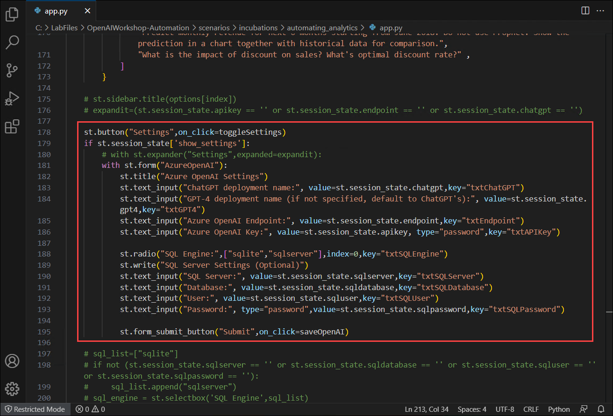
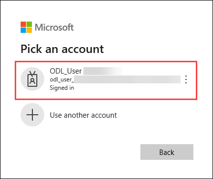
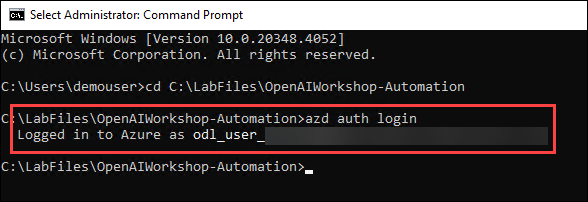
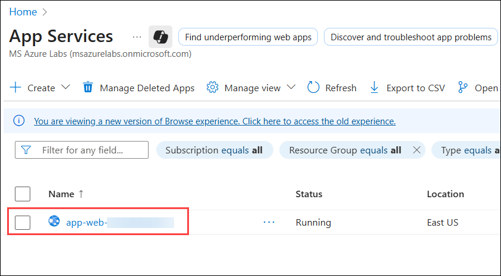
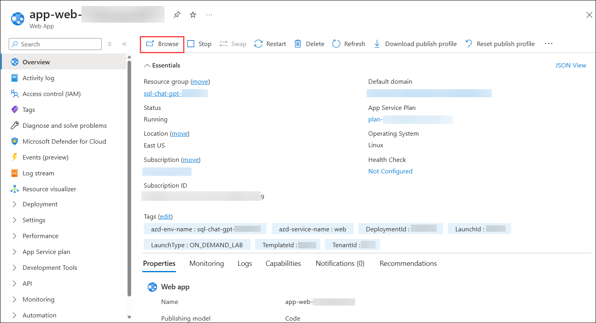

# Exercise 1: Open AI Setup and Installation of Application

### Estimated Duration : 60 Minutes

In this exercise, you will be setting up the Open AI resource and installation of the application to Azure.

## Objectives

In this Exercise, you will complete the following tasks:
- Task 1: Review Open AI resource
- Task 2: Deploy the application to Azure

## Task 1: Review Open AI resource

In this task, you will be reviewing the OpenAI deployments.

1. In the Azure portal, search for **Azure OpenAI (1)** in the top search box, then select **Azure OpenAI (2)** under services.

   
   
1. From the **Azure AI services | Azure OpenAI** pane, select **SQL-OpenAI-<inject key="Deployment ID" enableCopy="false"/>**.

   
   
1. In the Azure OpenAI resource pane, click on **Go to Azure AI Foundry portal** it will navigate to **Azure AI Foundry portal**.

   
      
1. In the **Azure AI Foundry**, select **Deployments (1)** under Shared resources and verify that **gpt-35-turbo** model is present with the deployment name as **sql-chatgpt-model (2)**, review that the capacity of the model is set to **40K TPM**. Copy the OpenAI Model name into the text file for later use.
   
   

   > **Note**: Click on the **Expand** button, if you dont see the left side navigation pane.

             
   
1. Naviagte back to **Azure portal**, expand **Resource Management (1)**, go to **Keys and Endpoint (2)**, click **Show Keys (3)**, then copy **KEY 1 (4)** and the **Endpoint (5)**, and save them for later use.

   

   > **Note**: If you don't see the Left side Navigation pane, click on the three horizontal line on the top left corner.
      
## Task 2: Deploy the application to Azure

In this task, you will be reviewing the code in the Visual Studio Code and publishing the application to Azure App Services through CLI.

1. In the LabVM, open **File Explorer** naviagte to the `C:\LabFiles\OpenAIWorkshop-Automation\scenarios\incubations\automating_analytics` **(1)** path, right click on **app.py (2)**, and select **Open with Code (3)**. Take a look at the code to see how it works.

   

   - The provided code is a Streamlit application that consists of two main components: a SQL Query Writing Assistant and a Data Analysis Assistant. The application allows you to interact with an SQL database and perform various tasks.

   - The code begins with importing necessary libraries and dependencies such as Streamlit, Pandas, NumPy, Plotly, and others. It also imports custom modules like AnalyzeGPT, SQL_Query, and ChatGPT_Handler.
  
1. If the pop up appears for **Do you trust the authors of the file in this folder**, click on **Yes, I trust the authors.**

   

1. In the code snippet, you can configure Azure OpenAI deployment settings and optional SQL Server settings. It provides input fields for entering deployment names, endpoints, API keys, and SQL Server details. With Streamlit, you can save settings and customize the application's functionality. Settings allow you to customize the application's behavior based on your specific needs, enhancing the overall experience.

   

1. The code snippet creates a chat interface using two GPT models, "ChatGPT" and "GPT-4". There are various models to choose from, FAQs specific to each model, and a form to ask questions. Moreover, the code includes options for showing the code and prompts, allowing you to interact with the chat interface more easily.

   

1. There is a "Submit" button in the code snippet that triggers a series of checks and actions. It verifies that the necessary deployment settings and SQL server settings are provided. If all requirements are met, it creates an SQL query tool and an analyzer object. To run queries and display results, it uses different methods based on the index value.

      
      
1. In the LabVM, navigate to Desktop and search for `cmd` **(1)** in the search box then click on **Command Prompt (2)**.

   

1. Run the below command to change the directory.

   ```bash
   cd C:\LabFiles\OpenAIWorkshop-Automation
   ```

   

1. Run the below command to **Authenticate with Azure**. It will redirect to Azure authorize website, select your account.

   ```bash
   azd auth login
   ```


1. Select the **ODL_User <inject key="Deployment ID" enableCopy="false"/>** account shown to proceed with the **sign-in**.

   

1. You will be signed in to your **Azure account**.

   

    >**Note:** The warnings can be ignored.

   

1. Run the below command to setup the resource group deployment and **Create a new environment**. Make sure to replace `{DeploymentId}` with **<inject key="Deployment ID" enableCopy="true"/>** in the below command.

   ```bash
   azd config set alpha.resourceGroupDeployments on
   ```
   
   ```bash
   azd env new sql-chat-gpt-{DeploymentId}
   ```

   

1. Run the below command to Provision Azure resources, and deploy your project with a single command.

   ```bash
   azd up
   ```

1. Please select your Azure Subscription to use, enter `1` and click on the **Enter** button.

      

1. Please select an Azure location to use, select the location as **<inject key="Region" enableCopy="false"/>** location, and click on the **Enter** button. You can change the location using the up and down arrow.

   

1. Once the deployment succeeded, you will see the following message **SUCCESS:  Your up workflow to provision and deploy to Azure completed**. The deployment might take 5 - 10 minutes. It is producing a web package file, then creating the resource and publishing the package to the app service.

      

1. Navigate back to the Azure portal, search for **App service (1)** and select **App services (2)**.

      

1. Select the available web app that you have deployed in the previous step.

      

1. Next, click on **Browse** to open your Web application.

      
      
      

   > **Congratulations** on completing the task! Now, it's time to validate it. Here are the steps:
   - If you receive a success message, you can proceed to the next task.
   - If not, carefully read the error message and retry the step, following the instructions in the lab guide.
   - If you need any assistance, please contact us at cloudlabs-support@spektrasystems.com. We are available 24/7 to help you out.
 
   <validation step="d47c14c0-5c3c-489c-9872-959b900195b5" />
   
## Summary

In this exercise, you completed the following tasks:

- Reviewed the Azure OpenAI resource configuration.

- Deployed an application to Azure integrated with the OpenAI service.

### You have successfully completed the lab. Now, click on **Next >>** from the lower right corner to proceed on to the next lab.


