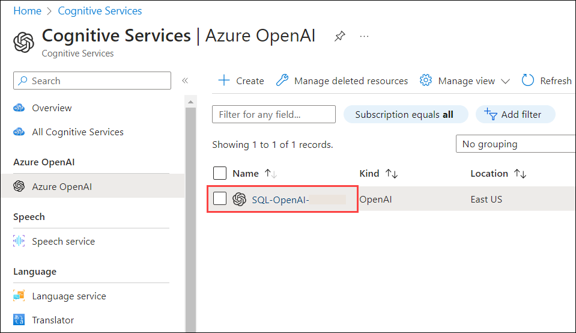
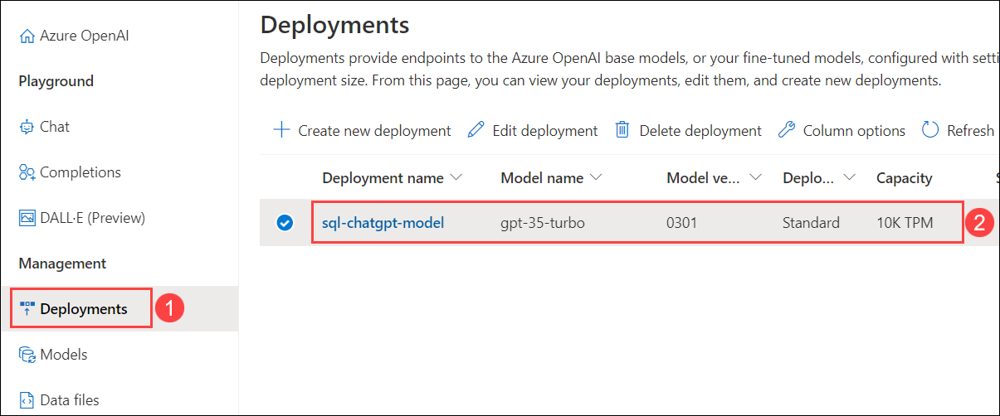
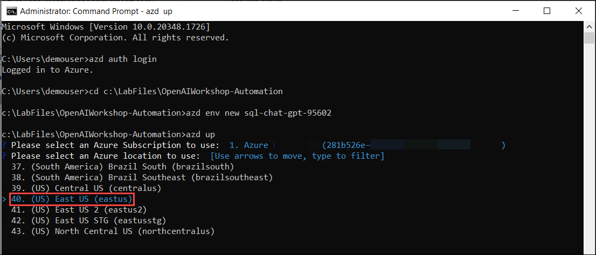
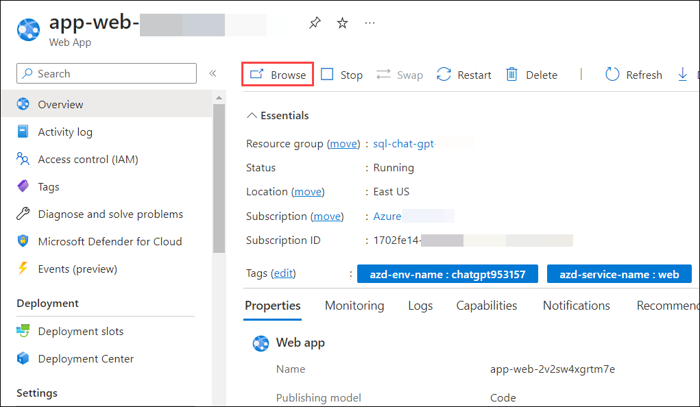

# Azure OpenAI + NLP using ChatGPT on SQL Engine

## Overview

This application demonstrates the of Open AI (ChatGPT/GPT-4) to help answer business questions by performing advanced data analytic tasks on a business database. Examples of questions are:

 * Simple: Show me daily revenue trends in 2016 per region
 * More difficult: Is that true that the top 20% of customers generate 80% of revenue in 2016?
 * Advanced: Forecast monthly revenue for the next 12 months starting from June-2018

The application supports Python's built-in SQLite as well as your own Microsoft SQL Server.

## Exercise 1: Open AI Setup and Installation of Application

In this exercise, you will be setting up the Open AI resource and installation of the application to Azure.

### Task 1: Review Open AI resource

1. In the Azure portal, search for **Azure OpenAI** **(1)** in the top search box then select **Azure OpenAI** **(2)** under services.

   
   
1. From the **Cognitive Services | Azure OpenAI** pane, select **sql-chat-gpt-<inject key="Deployment ID" enableCopy="false"/>**.

   
   
1. In the Azure OpenAI resource pane, click on **Go to Azure OpenAI Studio** it will navigate to **Azure AI Studio**.

   
      
1. In the **Azure AI Studio**, select **Deployments (1)** under Management and verify that **gpt-35-turbo** model is present with the deployment name as **sql-chatgpt-model**, review that the capacity of the module is set to **10K TPM**. Copy the OpenAI Model name into the text file for later use.
   
   
   
1. Naviagte back to [Azure portal](http://portal.azure.com/), search and select **Azure OpenAI**, from the **Cognitive Services | Azure OpenAI pane**, select the **SQL-OpenAI-<inject key="Deployment ID" enableCopy="false"/>**.

1. Now select **Keys and Endpoints** **(1)** under Resource Management and click on **Show Keys** **(2)**. Copy the **KEY 1** **(3)** and **Endpoint** **(4)**, store it in a text file for later use.

   
      
### Task 2: Deploy the application to Azure

1. In the LabVM, open **File Explorer** naviagte to the `C:\LabFiles\OpenAIWorkshop-Automation\scenarios\incubations\automating_analytics` **(1)** path, right click on **app.py (2)**, and select **Open with Code (3)**. Take a look at the code to see how it works.

   

   - The provided code is a Streamlit application that consists of two main components: a SQL Query Writing Assistant and a Data Analysis Assistant. The application allows you to interact with a SQL database and perform various tasks.

   - The code begins with importing necessary libraries and dependencies such as Streamlit, Pandas, NumPy, Plotly, and others. It also imports custom modules like AnalyzeGPT, SQL_Query, and ChatGPT_Handler.

2. In the code snippet, you can configure Azure OpenAI deployment settings and optional SQL Server settings. It provides input fields for entering deployment names, endpoints, API keys, and SQL Server details. With Streamlit, you can save settings and customize the application's functionality. Settings allow you to customize the application's behavior based on your specific needs, enhancing the overall experience.

   

3. The code snippet creates a chat interface using two GPT models, "ChatGPT" and "GPT-4". There are various models to choose from, FAQs specific to each model, and a form to ask questions. Moreover, the code includes options for showing the code and prompts, allowing you to interact with the chat interface more easily.

   

4. There is a "Submit" button in the code snippet that triggers a series of checks and actions. It verifies that the necessary deployment settings and SQL server settings are provided. If all requirements are met, it creates an SQL query tool and an analyzer object. To run queries and display results, it uses different methods based on the index value.

      
      
5. In the LabVM, navigate to Desktop and search for `cmd` in the search box then click on **Command Prompt**.

6. Run the below command to change the directory.

   ```bash
   cd C:\LabFiles\OpenAIWorkshop-Automation
   ```

7. Run the below command to **Authenticate with Azure**. It will redirect to Azure authorize website, select your account.

   ```bash
   azd auth login
   ```

8. Run the below command to setup the resource group deployment and **Create a new environment**. Make sure to replace `{DeploymentId}` with **<inject key="Deployment ID" enableCopy="true"/>** in the below command.

   ```bash
   azd config set alpha.resourceGroupDeployments on
   ```
   
   ```bash
   azd env new sql-chat-gpt-{DeploymentId}
   ```

9. Run the below command to Provision Azure resources, and deploy your project with a single command.

   ```bash
   azd up
   ```

10. Please select your Azure Subscription to use, enter `1` and click on **Enter** button.

      

11. Please select an Azure location to use, select the location as **<inject key="Region" enableCopy="false"/>** location, and click on **Enter** button. You can change the location using up and down arrow.

      

12. Once the deployment succeeded, you will see the following message **SUCCESS: Your application was provisioned and deployed to Azure**. The deployment might take 5 - 10 minutes. It is producing a web package file, then creating the resource and publishing the package to the app service.

      

13. Naviagte back to the Azure portal, search and select **App service**. Select the available web app which you have deployed in the previous step.

      

14. Next, click on **Browse** to open your Web application.

      
      
      

15. Click the **Next** button located in the bottom right corner of this lab guide to continue with the next exercise.

## Summary

In this exercise, you have completed OpenAI Setup and hosting a demo application to Azure. You will be exploring the demo application in the next exercise, click **Next** to continue with the lab.
   
