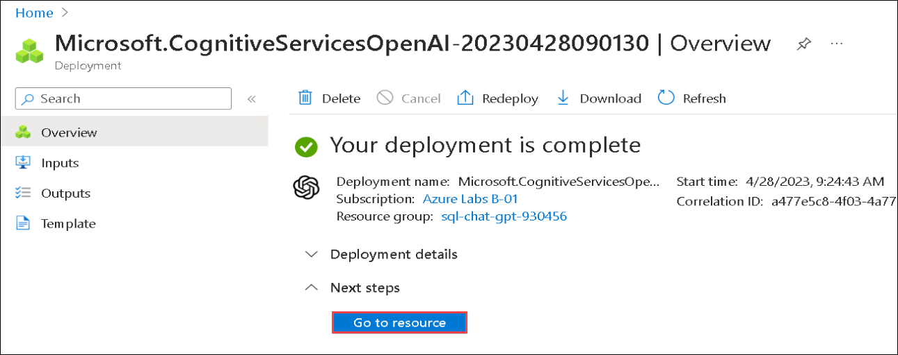
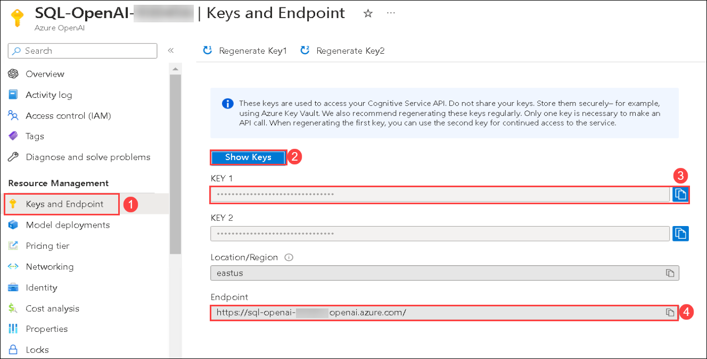
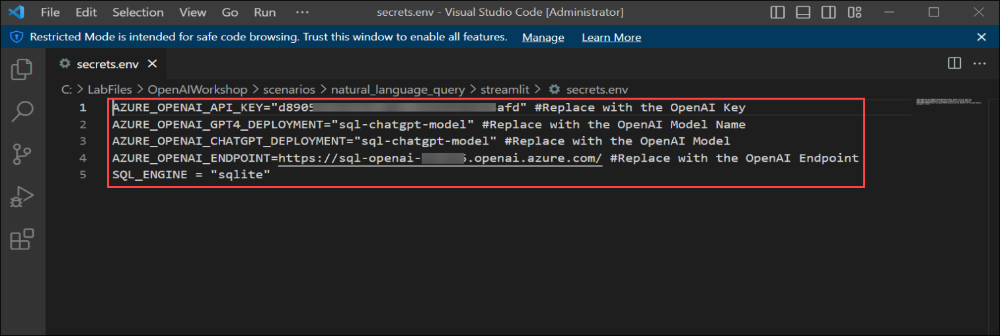
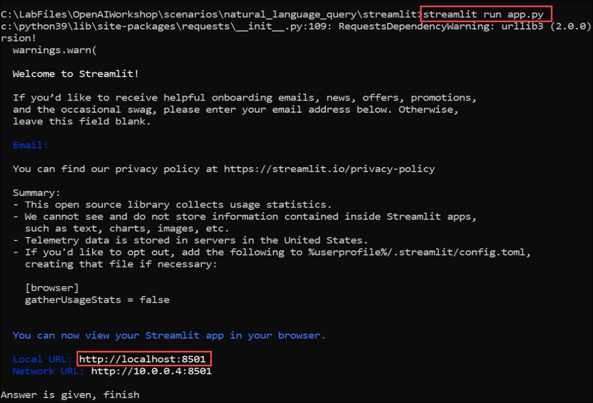

# SQL-ChatGPT-Workshops

## Overview

This application demonstrates the of Open AI (ChatGPT/GPT-4) to help answer business questions by performing advanced data analytic tasks on a business database. Examples of questions are:

 * Simple: Show me daily revenue trends in 2016 per region
 * More difficult: Is that true that top 20% customers generate 80% revenue in 2016?
 * Advanced: Forecast monthly revenue for next 12 months starting from June-2018

The application supports Python's built-in SQLITE as well as your own Microsoft SQL Server.

## Exercise 1: Open AI setup and Installation of Application

In this exercise, you will be setting up the Open AI resource and installtion of application locally.

### Task 1: Create Open AI resource

1. In the Azure portal, search for **Azure OpenAI** **(1)** in the top search box then select **Azure OpenAI** **(2)** under services.

   
   
1. From the **Cognitive Services | Azure OpenAI** pane, click on **Create**.

   
   
1. In the Create Azure OpenAI pane under Basics tab, select the default subscription and select the existing **sql-chat-gpt-<inject key="Deployment ID/Suffix" enableCopy="false"/>** resource group. Select **East US** as Region, enter Name as **SQL-OpenAI-<inject key="DeploymentID/Suffix" enableCopy="false"/>** and select **Standard S0** for Pricing tier. Click on **Next**

   
   
1. Leave default settings for Network and Tags tabs, click on **Next**.

1. In the Review + submit pane, verify that validation passed and then click on **Create**.

   
   
1. Deployment will take 5 minutes to complete. Once the deployments is succeeded, click on **Go to resource**.

   
   
1. In the Azure OpenAI resource pane, select **Model deployments** **(1)** under Resource Management and then click on **Create** **(2)**.

   
   
1. You will see create model deployment pane appears in the right-side, enter the Model deployement name as **sql-chatgpt-model** **(1)** and select **gpt-35-turbo** **(2)** Model deployment with the version **0301** **(3)** then click on **Save** **(4)**. Copy OpenAI Model name into the text file for later use.

   
   
1. Now select **Keys and Endpoints** **(1)** under Resource Management and click on **Show Keys** **(2)**. Copy the **KEY 1** **(3)** and **Endpoint** **(4)**, store it in a text file for later use.

   
   
### Task 2: Install the application locally

1. In the LabVM, navigate to Desktop and search for `cmd` in the search box then click on **Command Prompt**.

   
1. Run the below command to change the directory.

   ```
   cd C:\LabFiles\OpenAIWorkshop\scenarios\natural_language_query\streamlit
   ```
   
1. Provide settings for Open AI and Database by creating a ```secrets.env``` file in the root of this folder by running the below command.

   ```
   code secrets.env
   ```
   
1. You will see the Visual Studio code is opened in the desktop. Enter the below code and update the OpenAI Key, Model Name and Endpoint values which you have copied and stored in text file earlier.

   ```
   AZURE_OPENAI_API_KEY="********************************" #Replace with the OpenAI Key
   AZURE_OPENAI_GPT4_DEPLOYMENT="NAME_OF_GPT_4_DEPLOYMENT" #Replace with the OpenAI Model Name
   AZURE_OPENAI_CHATGPT_DEPLOYMENT="NAME_OF_CHATGPT_4_DEPLOYMENT" #Replace with the OpenAI Model
   AZURE_OPENAI_ENDPOINT=https://openairesourcename.openai.azure.com/ #Replace with the OpenAI Endpoint
   SQL_ENGINE = "sqlite"
   ```
   
1. After updating values the `secrets.env` file should be as shown in the below screenshot, press **CTRL + S** to save the file.

   
   
1. To run the application from the command line navigate back to Command Prompt and run the below command:

   ```
   streamlit run app.py
   ```
   
1. Once the execution of `streamlit run app.py` is completed. A locally hosted demo appliation will be opened in the web browser.

   
   
   

## Summary

In this exercise, you have completed OpenAI Setup and hosting a demo application locally. You will be exploring the demo application in the next exercise, click **Next** to continue with the lab.
   
