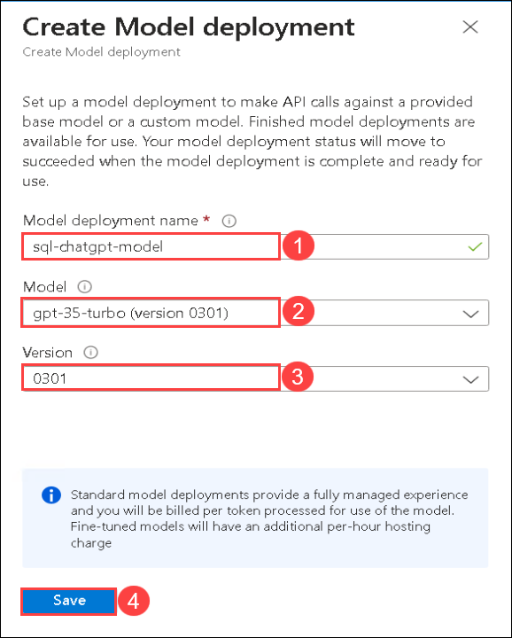
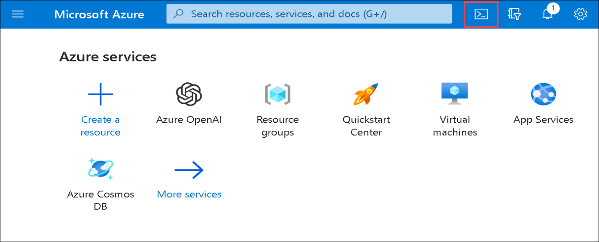

# SQL-ChatGPT-Workshops

## Overview

This application demonstrates the of Open AI (ChatGPT/GPT-4) to help answer business questions by performing advanced data analytic tasks on a business database. Examples of questions are:

 * Simple: Show me daily revenue trends in 2016 per region
 * More difficult: Is that true that top 20% customers generate 80% revenue in 2016?
 * Advanced: Forecast monthly revenue for next 12 months starting from June-2018

The application supports Python's built-in SQLITE as well as your own Microsoft SQL Server.

## Exercise 1: Open AI setup and Installation of Application

In this exercise, you will be setting up the Open AI resource and installtion of application locally.

### Task 1: Create Open AI resource

1. In the Azure portal, search for **Azure OpenAI** **(1)** in the top search box then select **Azure OpenAI** **(2)** under services.

   
   
1. From the **Cognitive Services | Azure OpenAI** pane, click on **Create**.

   
   
1. In the Create Azure OpenAI pane under Basics tab, select the default subscription and select the existing **sql-chat-gpt-<inject key="DeploymentID/Suffix" enableCopy="false"/>** resource group. Select **East US** as Region, enter Name as **SQL-OpenAI-<inject key="DeploymentID/Suffix" enableCopy="false"/>** and select **Standard S0** for Pricing tier. Click on **Next**

   
   
1. Leave default settings for Network and Tags tabs, click on **Next**.

1. In the Review + submit pane, verify that validation passed and then click on **Create**.

   
   
1. Deployment will take 5 minutes to complete. Once the deployments is succeeded, click on **Go to resource**.

   
   
1. In the Azure OpenAI resource pane, select **Model deployments** **(1)** under Resource Management and then click on **Create** **(2)**.

   
   
1. You will see create model deployment pane appears in the right-side, enter the Model deployement name as **sql-chatgpt-model** **(1)** and select **gpt-35-turbo** **(2)** Model deployment with the version **0301** **(3)** then click on **Save** **(4)**.

   
   
1. Now select **Keys and Endpoints** **(1)** under Resource Management and click on **Show Keys** **(2)**. Copy the **KEY 1** **(3)** and **Endpoint** **(4)**, store it in a text file for later use.

   
   
### Task 2: Install the application locally

1. Navigate back to Home page of Azure portal and open **Cloud Shell**.

   
   
1. In the Welcome to Azure Cloud Shell pane, select **Bash** and click on show advanced settings to mount the storage account to Cloud Shell.

1. Leave deafult settings, select **Create new** **(1)** File share and enter name as **blob** **(2)**. Then click on **Create storage** **(3)**.
  
   

1. Run the below code to clone the **OpenAI Workshop** Repo.

   ```
   git clone https://github.com/microsoft/OpenAIWorkshop.git
   ```
   
1. Once the Git Repo is cloned. Run the below command to change the directory.

   ```
   cd OpenAIWorkshop/scenarios/natural_language_query/streamlit
   ```
   
   
   
1. Provide settings for Open AI and Database by creating a ```secrets.env``` file in the root of this folder by running the below command **(1)**.

   ```
   code secrets.env
   ```
   
1. Enter the below below code in the codespace and update the OpenAI Key, Model Name and Endpoint values **(2)** which you have copied and stored in text file earlier.

   ```
   AZURE_OPENAI_API_KEY="********************************" #Replace with the OpenAI Key
   AZURE_OPENAI_GPT4_DEPLOYMENT="NAME_OF_GPT_4_DEPLOYMENT" #Replace with the OpenAI Model Name
   AZURE_OPENAI_CHATGPT_DEPLOYMENT="NAME_OF_CHATGPT_4_DEPLOYMENT" #Replace with the OpenAI Model
   AZURE_OPENAI_ENDPOINT=https://openairesourcename.openai.azure.com/ #Replace with the OpenAI Endpoint
   SQL_ENGINE = "sqlite"
   ```
   
   
   
1. Click on the ellipse **(1)** at the right top-corner for more options in the Code editor window and then click **Save** **(2)**.

   
   
1. Once again click on the ellipse **(1)** at the right top-corner for more options in the Code editor window and then click **Close Editor** **(2)**.

   
   
1. Make sure you are in the ```OpenAIWorkshop/scenarios/natural_language_query/streamlit`` directory. If not run the below command:

   ```
   cd OpenAIWorkshop/scenarios/natural_language_query/streamlit
   ```
  
1. Check the Python version installed and import the required pacakages by running the below commands.

   ```
   python --version
   pip install -r requirements.txt
   ```
   
1. To run the application from the command line, run the below command:

   ```
   streamlit run app.py
   ```
   
