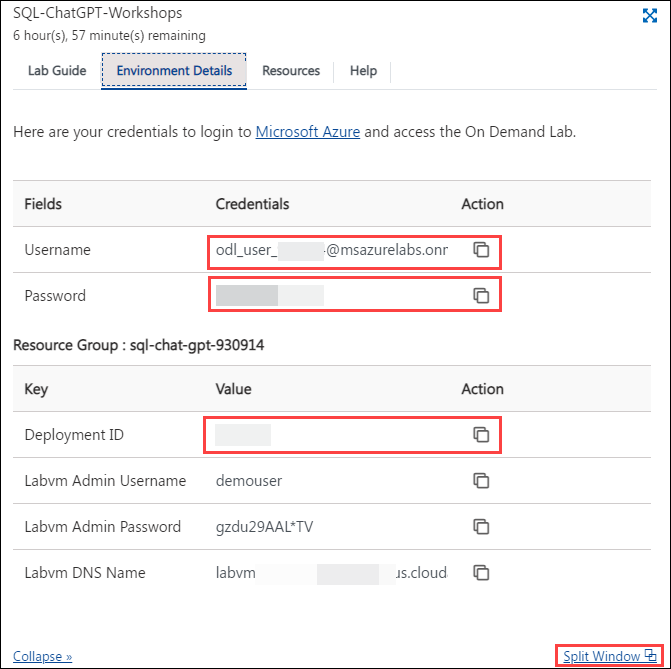
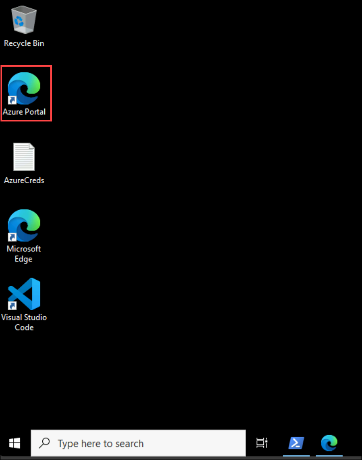
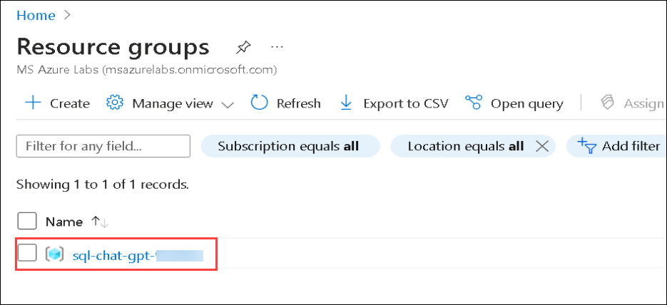

# Azure OpenAI + NLP using ChatGPT on SQL Engine

## Overall Estimated Duration: 4 Hours

## Overview

This application showcases the capabilities of OpenAI's ChatGPT (GPT-4) in addressing complex business questions through advanced data analytics on a business database. The tool can handle a range of queries, from simple data retrieval to sophisticated predictive analytics. Examples of questions it can answer include:

- **Simple**: "Show me daily revenue trends in 2016 per region."

- **Intermediate**: "Is it true that the top 20% of customers generated 80% of the revenue in 2016?"

- **Advanced**: "Forecast monthly revenue for the next 12 months starting from June 2018."

The application supports data analysis using both Python's built-in SQLite and external databases, such as Microsoft SQL Server. This versatility allows businesses to leverage their existing data infrastructure while gaining actionable insights through natural language queries.

## Objective

In this lab, you will perform:

- **Deploy the Application to Azure** : Reviewing the Open AI resource created in Azure. Deploying the application to Azure App Service using command line interface.
- **Working with hosted Application** : Working with the hosted Demo Application. Analyzing and working with the Data Analysis Assistant and SQL Query Writing Assistant.

## Pre-requisites
- **Fundamental Knowledge of Azure Services** : Knowing about some of the basic services like App Services.
- **Basic Understanding Programming Language** : basic understanding of programming languages like python or csharp.

## Getting Started with Lab

1. Once the environment is provisioned, a virtual machine (JumpVM) and lab guide will get loaded in your browser. Use this virtual machine throughout the workshop to perform the lab. You can see the number on the bottom of the lab guide to switch to different exercises of the lab guide.

   
 
1. To get the lab environment details, you can select the **Environment Details** tab. Additionally, the credentials will also be emailed to your registered email address. You can also open the Lab Guide in a separate and full window by selecting the **Split Window** from the lower right corner. Also, you can start, stop and restart virtual machines from the **Resources** tab.

   
 
   > You will see the SUFFIX value on the **Environment Details** tab, use it wherever you see SUFFIX or DeploymentID in lab steps.
 
## Login to Azure Portal

1. In the JumpVM, click on the Azure portal shortcut of the Microsoft Edge browser which is created on the desktop.

   
   
1. On the **Sign in to Microsoft Azure** tab you will see the login screen, in that enter the following email/username, and click on **Next**. 

   * **Email/Username**: <inject key="AzureAdUserEmail"></inject>
   
      
     
1. Now enter the following password and click on **Sign in**.
   
   * **Password**: <inject key="AzureAdUserPassword"></inject>
   
      
     
1. If you see the pop-up **Stay Signed in?**, select **No**.

1. If you see the pop-up **You have free Azure Advisor recommendations!**, close the window to continue the lab.

1. If a **Welcome to Microsoft Azure** popup window appears, select **Maybe Later** to skip the tour.
   
1. Now you will see the Azure Portal Dashboard, click on **Resource groups** from the Navigate panel to see the resource groups.

   
   
1. Confirm that you have all resource groups present as shown below.

   
   
1. Verify the resources deployed in the resource group.

   
   
1. Now, click on **Next** from the lower right corner to move on to the next page.

## Support Contact

The CloudLabs support team is available 24/7, 365 days a year, via email and live chat to ensure seamless assistance at any time. We offer dedicated support channels tailored specifically for both learners and instructors, ensuring that all your needs are promptly and efficiently addressed.

Learner Support Contacts:

- Email Support: labs-support@spektrasystems.com
- Live Chat Support: https://cloudlabs.ai/labs-support

## Happy Learning!!
