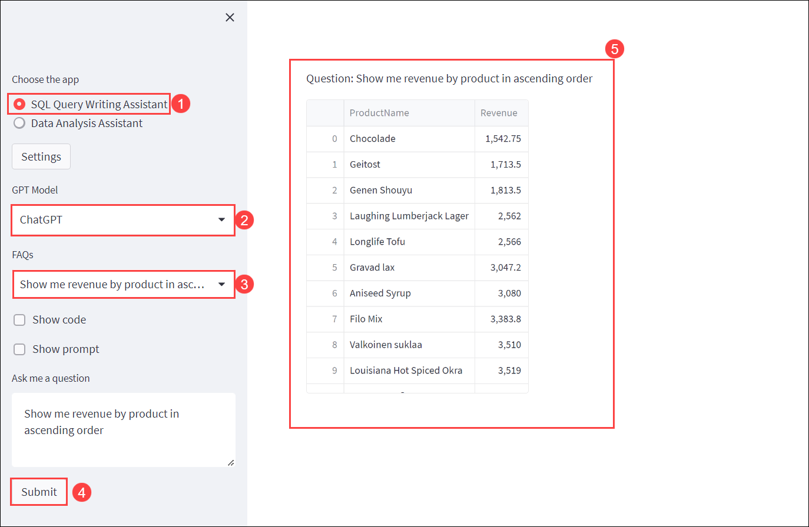
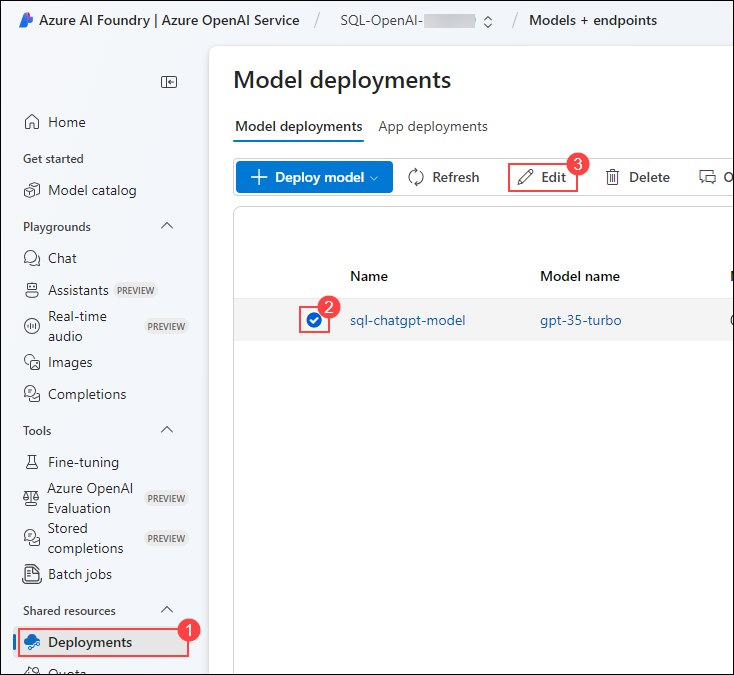
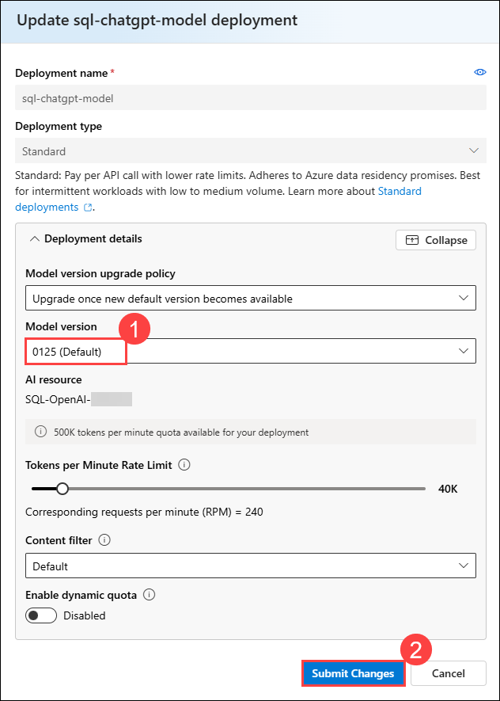
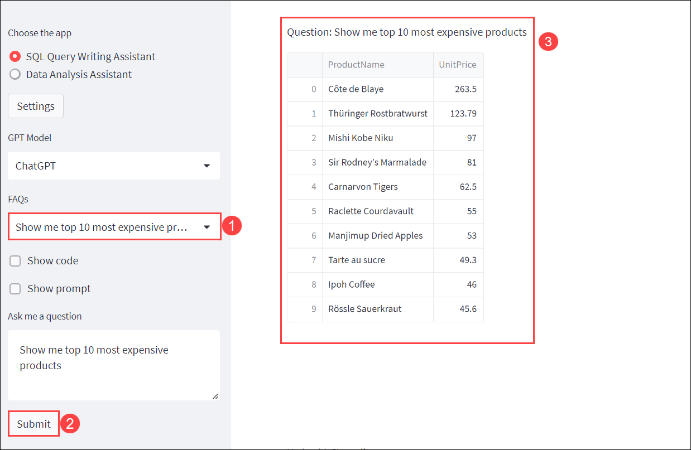
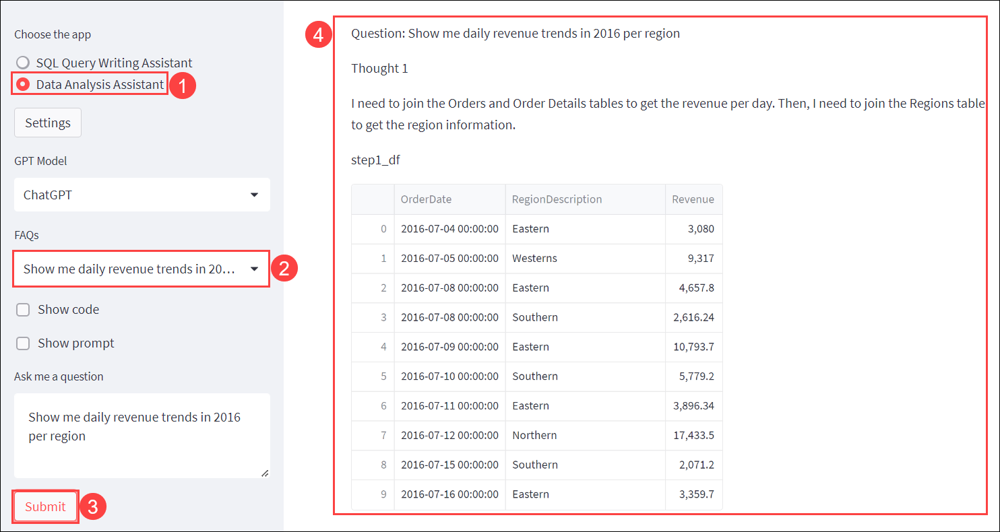
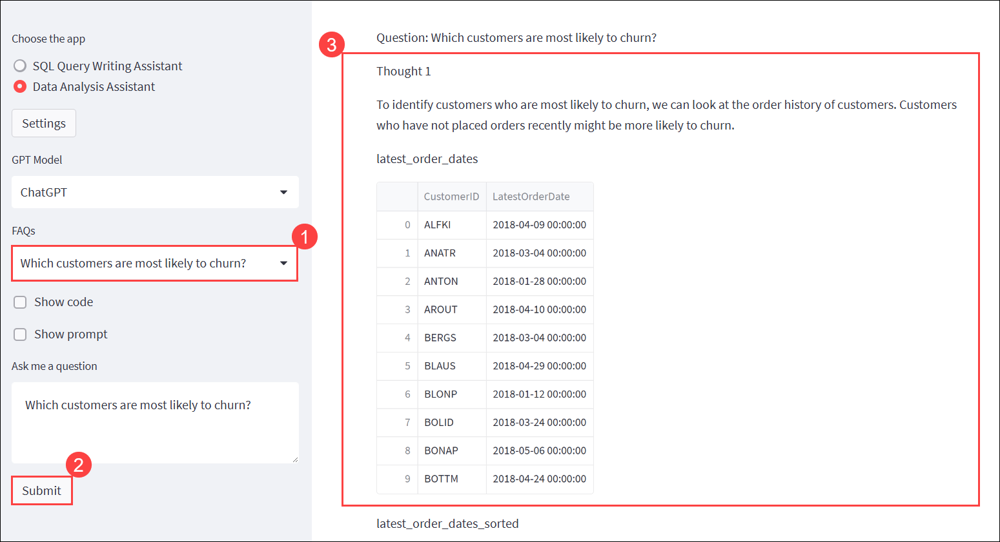
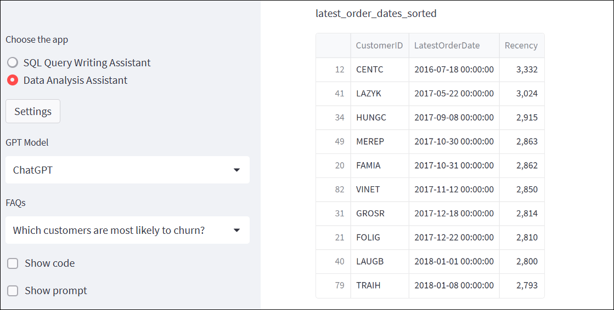
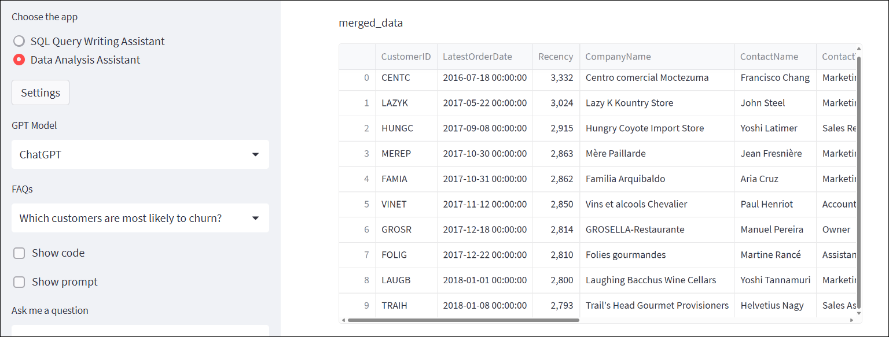
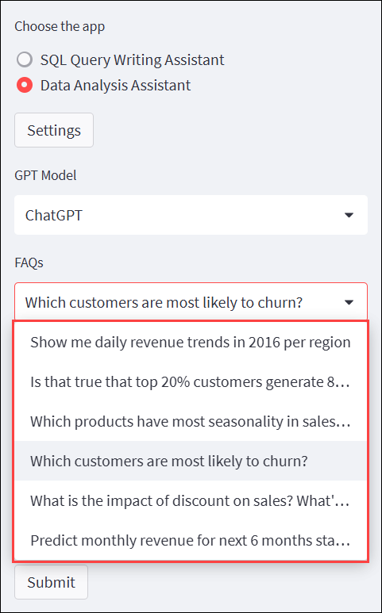

# Exercise 2: Quick Start With Hosted Demo Application

### Estimated Duration : 90 Minutes

In this exercise, you will utilize the application deployed in the previous exercise to work with the Data Analysis Assistant and SQL Query Writing Assistant features.

## Objectives

You will be able to complete the following tasks:

- Task 1: Analyzing Data Analysis Assistant and SQL Query Writing Assistant

## Task 1: Analyzing Data Analysis Assistant and SQL Query Writing Assistant

In this task, you will work with the Data Analysis Assistant and SQL Query Writing Assistant in the application.

1. On the **Natural Language Query** page, click **Settings (1)** from the left side menu, provide the following details and then click on **Submit(6)** to save the changes.

    - ChatGPT deployment name: **sql-chatgpt-model (2)**
    - GPT-4 deployment name: **sql-chatgpt-model (3)**
    - Azure OpenAI Endpoint: Enter **Endpoint (4)** which you have saved in notepad.
    - Azure OpenAI Key: Enter **Key (5)** which you have saved in notepad.

       

       >**Note:** Try to submit the query again in case of any errors in the output.

1. On the Natural Language Query page, select **SQL Query Writing Assistant (1)** from the left-side menu, choose **ChatGPT (2)** as the GPT model, select the FAQ: **Show me revenue by product in ascending order (3)**, click **Submit (4)**, and view the **result (5)** in the output section.

    

   >**Note:** If you get an error stating that the maximum limit reached, please follow the below steps to change the model version.
     
      - Navigate to the browser tab where Azure AI Foundry portal is opened.
     
     - From the left navigation pane click on **Deployments (1)**, select the **sql-chatgpt-model (2)** and click on **Edit (3)**.

         
     
     - For the Model version select **0125(Default)** option and click on **Save and close**.

         

     - Now back in the Azure portal launch the web app again from the App service resource and repeat step number 1 and 2.

1. On the **Natural Language Query** page, select **Show me top 10 most expensive products (1)** from the **FAQs** dropdown, click **Submit (2)**, and view the **results (3)** in output section.

    

1. On the **Natural Language Query** page, on the left side menu, change the **FAQs** from the drop-down menu to select **Show me net revenue by year. Revenue time is based on the shipped date. (1)**, and click on **Submit (2)**. According to the query, the **Output (3)** will be displayed.

    

1. The dropdown menu allows you to browse the rest of the **FAQs** by changing the Input value. 

    

7. After executing all the FAQs. Change the **Choose the app** to **Data Analysis Assistant (1)**, select the **FAQs** from the drop-down menu to select **Show me daily revenue trends in 2016 per region (2)**, and click on **Submit (3)**. According to the query, the **Output (4)** will be displayed.

    

    

1. Once you explore the output part, select the **FAQs** from the drop-down menu to select **Which products have the most seasonality in sales quantity in 2016? (1)**, and click on **Submit (2)**. According to the query, the **Output (3)** will be displayed.
 
    

    

1. Once you explore the output part, select the **FAQs** from the drop-down menu to select **Which customers are most likely to churn? (1)**, and click on **Submit (2)**. According to the query, the **Output (3)** will be displayed.

    

    

       

1. The dropdown menu allows you to browse the rest of the **FAQs** by changing the Input value.

     

## Summary

In this exercise, you have completed the following:

- Analyzed the functionality of the Data Analysis Assistant and SQL Query Writing Assistant powered by ChatGPT.

## You have successfully completed the Hands-on lab. 

By completing the **Azure OpenAI + NLP using ChatGPT on SQL Engine** hands-on lab, you have developed practical expertise in enhancing ChatGPT with your own data using Azure OpenAI. You reviewed and deployed OpenAI resources and applications on Azure, gaining hands-on experience integrating AI with custom data sources. Additionally, you explored the capabilities of the Data Analysis Assistant and SQL Query Writing Assistant, demonstrating how natural language processing can simplify data analysis and SQL query generation. This end-to-end experience has equipped you with the skills to build intelligent, data-driven solutions leveraging Azure and OpenAI technologies.
