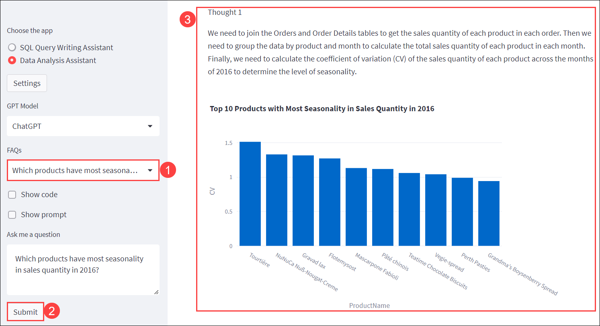
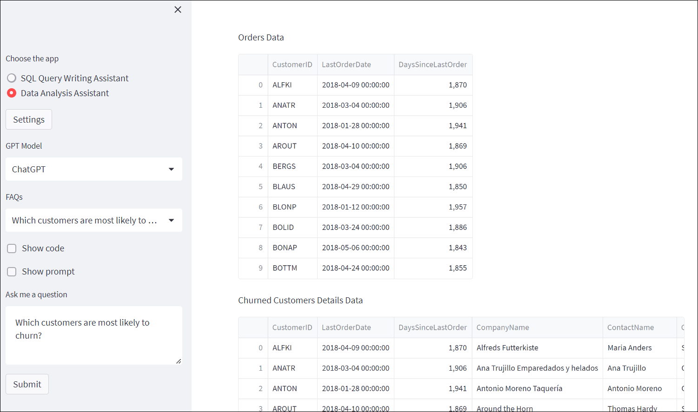

# Exercise 2: Quick Start With Hosted Demo Application.

In this exercise, you will be working with the application that you hosted in the previous exercise and work with the Data Analysis Assistant and SQL Query Writing Assistant in the application.

## Objectives

In this Exercise, you will complete the following task:
- Task 1: Analyzing Data Analysis Assistant and SQL Query Writing Assistant

### Task 1: Analyzing Data Analysis Assistant and SQL Query Writing Assistant

1. When you're on the **Natural Language Query** page, click on **Settings (1)** from the left side menu. Enter **ChatGPT deployment name** as **sql-chatgpt-model (2)**, enter **GPT-4 deployment name** as **sql-chatgpt-model (3)**, enter **Azure OpenAI Endpoint** as **Endpoint (4)** which you have saved in previous task, and **Azure OpenAI Key** as **Key (5)** which you have saved in previous task have all been filled in. Click on **Submit(6)** to save the changes.

    

2. On the Natural Language Query page, select **SQL Query Writing Assistant (1)** from the left-side menu, from the **GPT model**, select **ChatGPT (2)**,  change the **FAQs** from the drop-down menu to select **Show me revenue by-product in ascending order (3)**, and and click on **Submit (4)**. According to the query, the **Output (5)** will be displayed. 

    
    
3. On the **Natural Language Query** page, on the left side menu, change the **FAQs** from the drop-down menu to select **Show me top 10 most expensive products (1)**, and click on **Submit (2)**. According to the query, the **Output (3)** will be displayed.

    

4. On the **Natural Language Query** page, on the left side menu, change the **FAQs** from the drop-down menu to select **Show me net revenue by year. Revenue time is based on the shipped date. (1)**, and click on **Submit (2)**. According to the query, the **Output (3)** will be displayed.

    

5. The dropdown menu allows you to browse the rest of the **FAQs** by changing the Input value. 

6. After executing all the FAQs. Change the **Choose the app** to **Data Analysis Assistant (1)**, select the **FAQs** from the drop-down menu to select **Show me daily revenue trends in 2016 per region (2)**, and click on **Submit (3)**. According to the query, the **Output (4)** will be displayed.

    

    

    

8. Once you explore the output part, select the **FAQs** from the drop-down menu to select **Which products have the most seasonality in sales quantity in 2016? (1)**, and click on **Submit (2)**. According to the query, the **Output (3)** will be displayed.
 
    

     

9. Once you explore the output part, select the **FAQs** from the drop-down menu to select **Which customers are most likely to churn? (1)**, and click on **Submit (2)**. According to the query, the **Output (3)** will be displayed.

    

    
    
     
    
         

10. The dropdown menu allows you to browse the rest of the **FAQs** by changing the Input value.

    > **Congratulations** on completing the task! Now, it's time to validate it. Here are the steps:
    > - Navigate to the Lab Validation Page, from the upper right corner in the lab guide section.
    > - Hit the Validate button for the corresponding task. If you receive a success message, you can proceed to the next task. 
    > - If not, carefully read the error message and retry the step, following the instructions in the lab guide.
    > - If you need any assistance, please contact us at labs-support@spektrasystems.com. We are available 24/7 to help.

## Summary
In this exercise, you have worked with the application that you hosted in the previous exercise and utilized the Data Analysis Assistant and SQL Query Writing Assistant in the application.

## You have successfully completed the workshops.     
